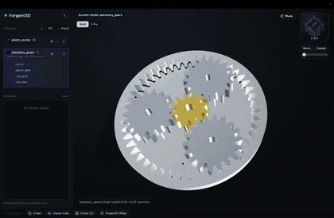
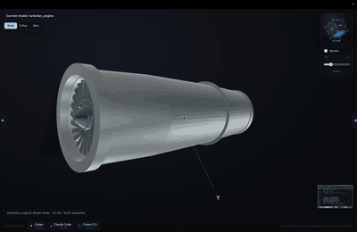

<p align="center">
  
</p>

<h1 align="center">Forgent3D</h1>

<p align="center">
  <strong>A local AI CAD companion for building, previewing, and iterating parametric 3D models with coding agents.</strong>
</p>

<p align="center">
  <a href="https://github.com/forgent3d/forgent3d/releases">
    
  </a>
  
  
  
</p>

<p align="center">
  <a href="README_zh.md">中文</a>
  ·
  <a href="#-download">Download</a>
  ·
  <a href="#-ai-agent-workflow">AI Agent Workflow</a>
  ·
  <a href="#-develop-from-source">Develop From Source</a>
  ·
  <a href="https://github.com/forgent3d/forgent3d/releases">Releases</a>
</p>

Forgent3D is an independent project exploring what CAD workflows look like when coding agents can generate, rebuild, inspect, and revise real geometry locally.

Download the desktop app from Releases. The bundled build includes the CAD runtime, so you can start without setting up Python or build123d manually.

<p align="center">
  <a href="https://github.com/forgent3d/forgent3d/releases"><strong>Download Forgent3D</strong></a>
</p>

### Planetary gear set



### Quadrotor drone


### Turbofan engine



## ✨ Why Forgent3D

Most AI-generated CAD workflows stop at source code. Forgent3D closes the loop: it gives agents and humans a fast way to build, preview, inspect, and iterate on real geometry.

- **Parametric CAD by default**: models are driven by `part.py` or `asm.xml` plus `params.json`, so dimensions and visual choices stay editable.
- **Live local preview**: rebuild models and inspect them in a Three.js viewer without leaving the desktop app.
- **AI-agent friendly**: built-in project skills and MCP tooling help agents generate, rebuild, screenshot, and verify CAD output.
- **Geometry-first validation**: model packages preview through MJCF, with screenshots and bounding-box data available for inspection.
- **Assemblies and motion**: compose multi-body systems with MJCF, reusable STL meshes, joints, constraints, and optional MuJoCo simulation.
- **Renderer materials**: use `__viewer.materials` in `params.json` to assign preview material presets and colors without mixing styling into geometry.

## 🚀 Download

Download the latest release:

<https://github.com/forgent3d/forgent3d/releases/>

The release app is the recommended way to try Forgent3D. It is packaged with the local CAD runtime and viewer, so you can create and inspect models without preparing a separate CAD development environment.

The app creates self-contained model packages under `models/`. Each model has a root `asm.xml` and `params.json`, with local editable parts beneath it:

```text
models/
  reference_mount/
    asm.xml
    params.json
    parts/
      mounting_plate/
        part.py
        params.json
      fastener_stack/
        part.py
        params.json
```

## 🧩 How It Works

```text
AI agent or editor
        |
        v
models/<name>/asm.xml + params.json
models/<name>/parts/<part>/part.py + params.json
        |
        v
Forgent3D build runner
        |
        v
MJCF model package preview
        |
        v
Interactive viewer, screenshots, geometry info, MCP feedback
```

## 🤖 AI Agent Workflow

Forgent3D is designed to sit next to AI coding tools. Launch your agent from the viewer so project-specific skills, rules, and MCP configuration are available.

A typical loop:

1. Ask the agent to create or modify a model.
2. The agent edits `part.py`, `asm.xml`, and `params.json`.
3. The agent calls the viewer rebuild tool.
4. Forgent3D updates the preview and caches geometry info.
5. The agent uses screenshots or bounding-box data to verify the result.

This keeps the workflow grounded in real geometry instead of text-only reasoning.

## 🛠️ Develop From Source

Most users should start with the release app. If you want to work on Forgent3D itself, run it from source with pnpm:

```bash
pnpm install
pnpm run build:electron
pnpm run build:runner
pnpm run dev
```

Building the embedded CAD runner currently requires Python 3.13. You can set `AICAD_PYTHON_BIN` if you want to point the build at a specific Python executable.

Useful scripts:

```bash
pnpm run build:renderer
pnpm run build
pnpm run start
```

## 🔗 Ecosystem

Forgent3D is part of a growing wave of open AI-assisted CAD experiments. Several projects are exploring how language models, code, and CAD geometry can work together.

- [CADAM](https://github.com/Adam-CAD/CADAM) explores browser-based text-to-CAD, with natural language or image input, parametric controls, browser preview, and common export formats.
- [text-to-cad](https://github.com/earthtojake/text-to-cad) explores CAD skills and workflows for coding agents such as Codex and Claude Code. It is one of the closest projects in spirit to Forgent3D.
- [ForgeCAD](https://github.com/KoStard/ForgeCAD) explores code-first parametric CAD using JavaScript/TypeScript, with a browser workbench, local CLI, and agent-ready workflows.

Forgent3D focuses on the desktop workflow around agent-generated CAD: packaging the CAD runtime, viewer, agent bridge, rebuild loop, and geometry feedback into one installable app.

## 📄 License

The source code in this repository is available under the [MIT License](LICENSE).
