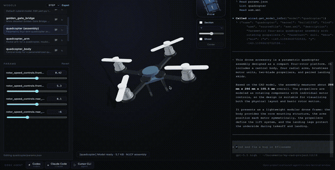

<p align="center">
  
</p>

<h1 align="center">Forgent3D</h1>

<p align="center">
  <strong>代码就是模型</strong>
</p>

<p align="center">
  <a href="https://github.com/forgent3d/forgent3d/releases">
    
  </a>
  
  
  
  
  <br />
  
  
  
  
  
  
  
  
</p>

<p align="center">
  <a href="README.md">English</a>
  ·
  <a href="#-核心思路">核心思路</a>
  ·
  <a href="#-快速开始">快速开始</a>
  ·
  <a href="https://github.com/forgent3d/forgent3d/releases">下载</a>
</p>

Forgent3D 是一个将大语言模型（LLM）生成的代码转化为三维模型，并进行实时预览的桌面工具（基于 Electron）。你可以用 AI 编程助手生成或修改参数化 CAD 代码，再通过 Forgent3D 立即查看真实的 3D 几何结果。



## ✨ 核心思路

打破传统的建模门槛，底层内核基于强大的 **build123d**，你可以自然地结合 **Cursor**、**Claude**、**Code** 或 **Codex** 等 AI 编程助手来生成和编写模型代码。Forgent3D 负责将这些代码即时渲染，让你直观地看到最终的 3D 效果。

- **参数化 CAD**：模型由 `part.py` 或 `asm.xml` 加 `params.json` 驱动，尺寸和视觉参数都可以持续编辑。
- **本地实时预览**：重建模型后直接在 Three.js 预览器中检查几何效果。
- **适合 AI Agent**：内置项目技能和 MCP 工具，方便 Agent 生成、重建、截图和验证模型。
- **几何优先验证**：单体零件可通过 BREP 预览，并提供面和包围盒信息用于检查。
- **装配与运动**：支持 MJCF 多体装配、STL 网格、关节、约束和可选 MuJoCo 仿真。

## 🚀 快速开始

最新版本下载地址： [https://github.com/forgent3d/forgent3d/releases/](https://github.com/forgent3d/forgent3d/releases/)

或者从源码运行：

```bash
pnpm install
npm run build:runner
npm run dev
```

应用会创建一个包含 `models/` 的项目目录。每个模型都有独立文件夹，里面保存源码和参数：

```text
models/
  bracket/
    part.py
    params.json
  linkage_demo/
    asm.xml
    params.json
```

## 🧩 工作方式

```text
AI Agent 或编辑器
        |
        v
models/<name>/part.py 或 asm.xml
models/<name>/params.json
        |
        v
Forgent3D build runner
        |
        v
BREP 零件预览或 MJCF 装配预览
        |
        v
交互式查看器、截图、几何信息、MCP 反馈
```

## 🤖 AI Agent 工作流

Forgent3D 适合和 AI 编程工具放在一起使用。你可以从查看器启动 Agent，让项目技能、规则和 MCP 配置自动可用。

典型流程：

1. 让 Agent 创建或修改模型。
2. Agent 编辑 `part.py`、`asm.xml` 和 `params.json`。
3. Agent 调用查看器的重建工具。
4. Forgent3D 更新预览并缓存几何信息。
5. Agent 使用截图或包围盒数据验证结果。

这样可以让 AI CAD 工作流落在真实几何上，而不是只停留在文本推理里。

## 🛠️ 开发

```bash
pnpm install
npm run build:runner
npm run dev
```

常用脚本：

```bash
npm run build:renderer
npm run build
npm run start
```

## 📄 协议

本项目采用 [MIT](LICENSE) 协议开源。
